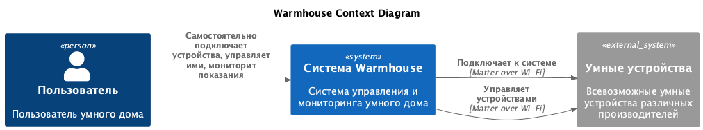

# Задание 1. Анализ и планирование

### 1. Описание функциональности монолитного приложения

- Система поддерживает настройку параметров через env
- Для работы системы необходим выезд специалиста на дом для установки датчиков

**Управление отоплением:**

- Пользователи могут удаленно включать/выключать отопление в своих домах

**Мониторинг температуры:**

- Пользователи могут удаленно проверять температуру в доме
- Система получает данные о температуре с датчиков, установленных в домах

### 2. Анализ архитектуры монолитного приложения

- **Язык программирования:** Go
- **База данных:** PostgreSQL
- **Архитектура:** Монолитная, все компоненты системы (обработка запросов, бизнес-логика, работа с данными) находятся в рамках одного приложения.
- **Взаимодействие:** Синхронное, запросы обрабатываются последовательно.
- **Масштабируемость:** Ограничена, так как монолит сложно масштабировать по частям.
- **Развертывание:** Требует остановки всего приложения.

### 3. Определение доменов и границы контекстов

- Домен: авторизация пользователя
- Домен: настройка умного дома
  - поддомен: подключение умного дома
  - поддомен: подключение пользователя к умному дому
  - поддомен: подключение умного устройства к дому
  - контекст: протокол Matter over Wi-Fi
  - контекст: протокол Wi-Fi
- Домен: мониторинг и управление умными устройствами
  - поддомен: мониторинг умных устройств
  - контекст: устройства-сенсоры
  - контекст: устройства, принимающие команды
  - поддомен: управление умными устройствами
  - поддомен: программирование сценариев

### 4. Проблемы монолитного решения

- **Хрупкость монолита:**
  - изменение какой-либо переиспользуемой функции может повлечь неожиданное изменение логики приложения ещё в нескольких местах
- **Жесткость монолита:**
  - долго и неприятно внедрять новую фичу из-за слишком большой кодовой базы и неочевидных связей в ней
- **Сложность масштабирования:**
  - освещение может быть более востребовано, чем автоматические ворота, а мы не можем масштабировать только его
- **Высокий риск сломать все приложение:**
  - поломка функций для одного из устройств повлечет поломку всего сервиса

### 5. Визуализация контекста системы — диаграмма С4

Диаграмма контекста в модели C4.



# Задание 2. Проектирование микросервисной архитектуры

В этом задании вам нужно предоставить только диаграммы в модели C4. Мы не просим вас отдельно описывать получившиеся микросервисы и то, как вы определили взаимодействия между компонентами To-Be системы. Если вы правильно подготовите диаграммы C4, они и так это покажут.

**Диаграмма контейнеров (Containers)**


**Диаграмма компонентов (Components)**


**Диаграмма кода (Code)**


# Задание 3. Разработка ER-диаграммы

Добавьте сюда ER-диаграмму. Она должна отражать ключевые сущности системы, их атрибуты и тип связей между ними.


# Задание 4. Создание и документирование API

### 1. Тип API

RESTful API с поддержкой WebSockets для реального времени

- RESTful API идеален для CRUD-операций (управление пользователями, домами, устройствами)
- WebSockets позволяет получать потоковые данные с датчиков
- Простая совместимость с фронтендом на React и микросервисами на NodeJS

### 2. Документация API

[auth_service](./docs/api/auth_service)
[devices_service](./docs/api/devices_service)
[home_service](./docs/api/home_service)

# Задание 5. Работа с docker и docker-compose

Перейдите в apps.

Там находится приложение-монолит для работы с датчиками температуры. В README.md описано как запустить решение.

Вам нужно:

1. сделать простое приложение temperature-api на любом удобном для вас языке программирования, которое при запросе /temperature?location= будет отдавать рандомное значение температуры.

Locations - название комнаты, sensorId - идентификатор названия комнаты

```
	// If no location is provided, use a default based on sensor ID
	if location == "" {
		switch sensorID {
		case "1":
			location = "Living Room"
		case "2":
			location = "Bedroom"
		case "3":
			location = "Kitchen"
		default:
			location = "Unknown"
		}
	}

	// If no sensor ID is provided, generate one based on location
	if sensorID == "" {
		switch location {
		case "Living Room":
			sensorID = "1"
		case "Bedroom":
			sensorID = "2"
		case "Kitchen":
			sensorID = "3"
		default:
			sensorID = "0"
		}
	}
```

2. Приложение следует упаковать в Docker и добавить в docker-compose. Порт по умолчанию должен быть 8081

3. Кроме того для smart_home приложения требуется база данных - добавьте в docker-compose файл настройки для запуска postgres с указанием скрипта инициализации ./smart_home/init.sql

Для проверки можно использовать Postman коллекцию smarthome-api.postman_collection.json и вызвать:

- Create Sensor
- Get All Sensors

Должно при каждом вызове отображаться разное значение температуры

Ревьюер будет проверять точно так же.
